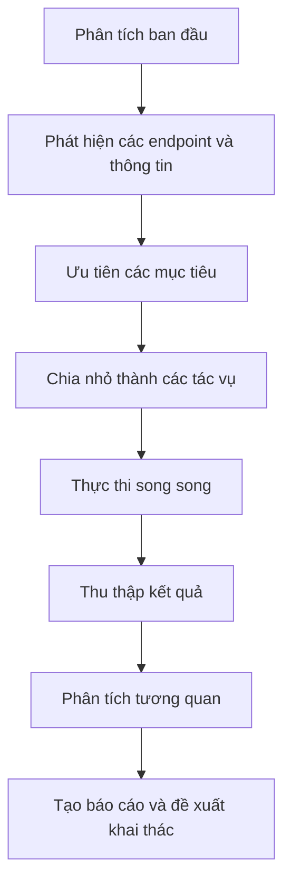

# SpyHunt - Chế độ AI & Phân tích thông minh

Tài liệu này mô tả chi tiết về các tính năng AI và phân tích thông minh của SpyHunt dành cho phân tích bảo mật và bug bounty.

## Giới thiệu

SpyHunt tích hợp trí tuệ nhân tạo tiên tiến để tối ưu hóa quá trình tìm kiếm lỗ hổng và các vấn đề bảo mật. Chế độ AI được thiết kế đặc biệt cho bug bounty và đánh giá bảo mật nâng cao, giúp phân tích thông minh, ưu tiên mục tiêu và tự động hóa quá trình tìm kiếm lỗ hổng có giá trị cao.

## Các tính năng chính

### 1. Phân tích mục tiêu thông minh

SpyHunt sử dụng class `SmartAISecurityAnalyzer` để phân tích mục tiêu thông minh:

```python
# Trích từ SmartAISecurityAnalyzer
def _prioritize_findings(self, all_findings):
    """Phân loại và ưu tiên các phát hiện dựa trên giá trị bảo mật"""
    
    # Tạo cấu trúc dữ liệu để lưu các phát hiện ưu tiên cao/trung bình/thấp
    priority_data = {
        "high_priority": {},
        "medium_priority": {},
        "low_priority": {},
        "metadata": {}
    }
    
    # Phân loại các endpoints và tham số quan trọng
    high_value_patterns = [
        "admin", "api", "token", "key", "password", "auth", "jwt", 
        "graphql", "firebase", "s3", "test", "dev", "staging", "oauth"
    ]
    
    # Phân tích và ưu tiên các đường dẫn có giá trị cao
    # Phân tích các tham số URL nhạy cảm
    # Chọn lọc thông tin có giá trị nhất
    
    return priority_data
```

### 2. Phân tích dành riêng cho Bug Bounty

SpyHunt phân tích tự động các lỗ hổng theo góc nhìn Bug Bounty, đánh giá mức độ nghiêm trọng và khả năng khai thác:

```python
def analyze_for_bug_bounty(self, all_findings, target_domain):
    """Phân tích dữ liệu theo góc nhìn bug bounty"""
    
    # Tối ưu hoá dữ liệu đầu vào để giảm token API
    optimized_data = self._optimize_token_usage(all_findings)
    
    # Xây dựng prompt thông minh cho phân tích
    prompt = self._build_targeted_prompt(optimized_data, target_domain)
    
    # Phân tích thông qua AI và nhận kết quả
    # Xác định các vectors tấn công tiềm năng
    # Sắp xếp theo mức độ nghiêm trọng và tiềm năng
    
    return analysis_results
```

### 3. Tạo quy trình làm việc tự động (Workflow)

SpyHunt có thể tạo quy trình làm việc tự động dựa trên phân tích ban đầu:

```python
def create_recon_workflow(self, target_domain, initial_findings=None):
    """Tạo quy trình làm việc tối ưu cho việc recon dựa trên loại mục tiêu"""
    
    # Xác định loại mục tiêu (web, API, mobile, cloud...)
    target_type = self._detect_target_type(target_domain, initial_findings)
    
    # Tạo quy trình phù hợp với từng loại mục tiêu
    workflow = {
        "target_domain": target_domain,
        "target_type": target_type,
        "phases": []
    }
    
    # Các giai đoạn được thiết kế riêng cho từng loại mục tiêu
    # Mỗi giai đoạn có các công cụ và kỹ thuật riêng
    
    return workflow
```

## Sử dụng chế độ AI

### Lệnh cơ bản

```bash
python spyhunt.py --ai-bug-bounty example.com
```

### Các tham số nâng cao

```bash
python spyhunt.py --ai-bug-bounty example.com --focus web_vulns --max-threads 10 --output-report detailed --exploit-chain
```

Trong đó:
- `--focus`: Chỉ định tập trung vào lĩnh vực cụ thể: web_vulns, network, api, cloud
- `--max-threads`: Số lượng luồng tối đa để chạy song song các tác vụ
- `--output-report`: Loại báo cáo (summary, detailed, full)
- `--exploit-chain`: Tự động tạo chuỗi khai thác nếu có thể

### Ví dụ quy trình làm việc

1. **Phân tích ban đầu**: Phân tích nhanh mục tiêu để xác định loại và cấu trúc
2. **Tạo quy trình tối ưu**: Dựa trên loại mục tiêu, tạo quy trình phù hợp
3. **Ưu tiên vector tấn công**: Xác định và ưu tiên các vector có khả năng thành công cao
4. **Chạy song song các tác vụ**: Thực hiện quét và tấn công song song nhiều tác vụ nhỏ
5. **Phân tích kết quả**: Gom kết quả và phân tích mối tương quan
6. **Đề xuất khai thác**: Tạo chuỗi khai thác có thể thực hiện

## So sánh với chế độ AutoRecon

| Tính năng | Chế độ AI | AutoRecon |
|-----------|-----------|-----------|
| Tự động điều chỉnh | ✅ Điều chỉnh thông minh dựa trên kết quả | ❌ Quy trình cố định |
| Ưu tiên mục tiêu | ✅ Ưu tiên theo giá trị bảo mật | ❌ Quét toàn bộ |
| Phân tích tương quan | ✅ Phân tích tương quan kết quả | ❌ Kết quả riêng lẻ |
| Tối ưu cho bug bounty | ✅ Thiết kế riêng cho bug bounty | ❌ Thiết kế cho đánh giá tổng quát |
| Tốc độ | ⚡ Nhanh hơn do tập trung | 🐢 Chậm hơn do quét toàn diện |

## Luồng dữ liệu của chế độ AI



## Class AI Security Manager

Class `AISecurityManager` quản lý toàn bộ quy trình AI:

```python
class AISecurityManager:
    def __init__(self):
        self.analyzer = SmartAISecurityAnalyzer()
        self.results = {}
        self.recommendations = []

    def update_scan_results(self, module_name, results):
        """Cập nhật kết quả từ một module cụ thể"""
        self.results[module_name] = results

    def analyze_current_state(self, target_domain):
        """Phân tích tình trạng hiện tại dựa trên dữ liệu đã thu thập"""
        return self.analyzer.analyze_for_bug_bounty(self.results, target_domain)

    def get_next_commands(self, target_domain, focus_area="all"):
        """Đề xuất các lệnh tiếp theo dựa trên phân tích hiện tại"""
        return self.analyzer.generate_targeted_commands(self.results, target_domain, focus_area)

    def get_recon_workflow(self, target_domain):
        """Lấy quy trình recon tối ưu cho mục tiêu"""
        return self.analyzer.create_recon_workflow(target_domain, self.results)
```

## Ứng dụng thực tế

### 1. Bug Bounty

Sử dụng chế độ AI để nhanh chóng xác định và khai thác các lỗ hổng có giá trị cao nhất:

```bash
python spyhunt.py --ai-bug-bounty target.com --focus web_vulns --output-report detailed
```

### 2. Kiểm tra bảo mật theo lĩnh vực

Tập trung kiểm tra vào một lĩnh vực cụ thể:

```bash
python spyhunt.py --ai-bug-bounty target.com --focus api --max-threads 20
```

### 3. Tạo báo cáo chuyên nghiệp

Tạo báo cáo chi tiết với phân tích từng lỗ hổng:

```bash
python spyhunt.py --ai-bug-bounty target.com --output-report full --export pdf
```

## Lưu ý và hạn chế

1. Chế độ AI yêu cầu kết nối internet để phân tích
2. Một số phân tích có thể cần thêm các thông tin bổ sung từ người dùng
3. Kết quả phụ thuộc vào chất lượng dữ liệu thu thập được từ quá trình quét
4. Nên kết hợp với đánh giá thủ công để có kết quả tốt nhất

## Roadmap tương lai

- Tích hợp các mô hình AI chuyên sâu hơn cho từng loại lỗ hổng
- Hỗ trợ phân tích mã nguồn tự động để tìm lỗ hổng
- Tối ưu hóa sử dụng các API AI để giảm chi phí
- Thêm các mẫu báo cáo chuyên nghiệp

## Kết luận

Chế độ AI của SpyHunt mang đến cách tiếp cận mới trong đánh giá bảo mật, giúp người dùng nhanh chóng xác định và tập trung vào các lỗ hổng có giá trị cao nhất, đặc biệt trong lĩnh vực bug bounty. 